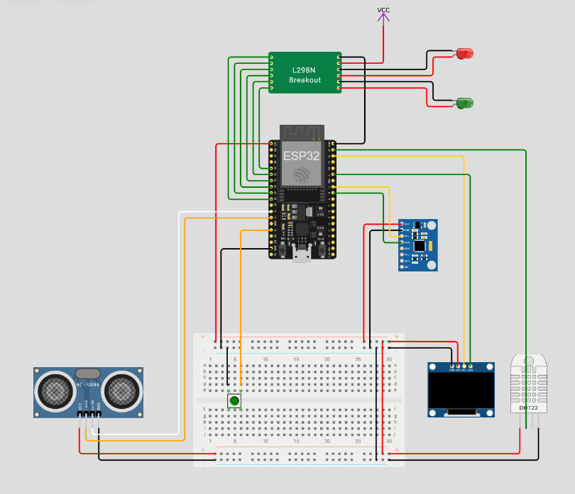
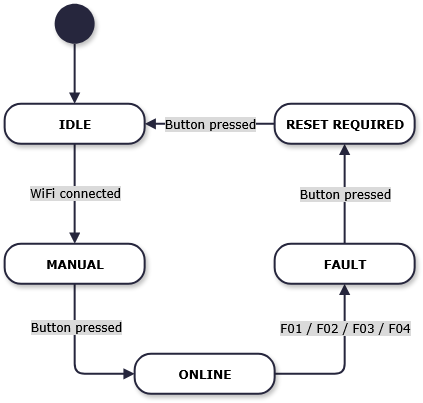
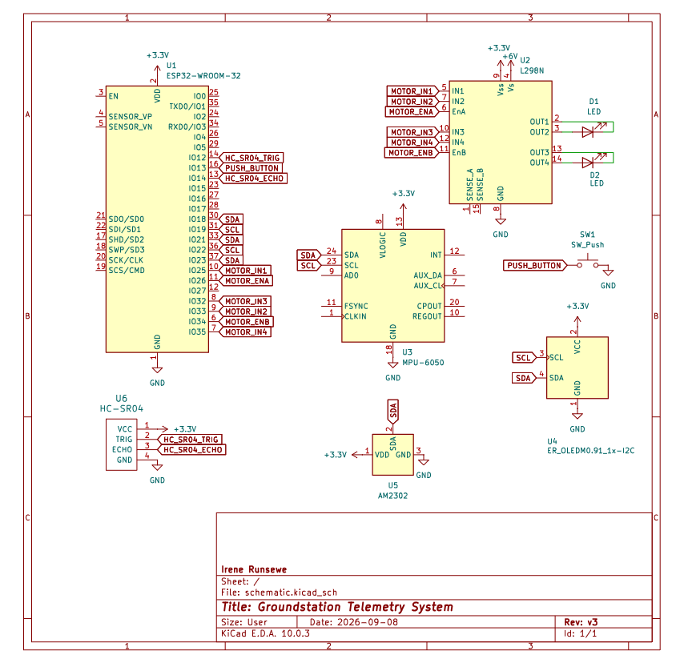

# Groundstation

This is an ESP32-based project for a WiFi-controlled car using sensor fusion and PID control. It uses a finite state machine to define the car's behaviour, sensor data, a basic web dashboard, and fault handling.

## Wokwi Diagram

  

## What It Does

When the ESP32 turns on, it connects to WiFi and starts a web server. Open the web page in a browser to see telemetry update every 100ms (10 Hz) with WebSocket. Drive commands are sent using WASD keys or the buttons on the webpage.

Sensors:
* HC-SR04 ultrasonic measures distance.
* DHT22 measures temperature.
* MPU6050 accelerometer and gyroscope handles tilt (pitch & roll) with a complementary filter.
* SSD1306 OLED displays system state and faults.

## PID Control & Complementary Filter
### Why did I PID Control for the motors?
Motors do not naturally spin at the exact same speed. For a small robot like mine, that might not be an issue if it is not driving for too long. But for a larger project or one that needs more reproducible results, this would cause the robot to drift to one side instead of driving straight. So, PID control aims to constantly check each wheel's encoder wheel ticks, compare them to the target speed, then using math, automatically adjust the motor power to fix the error.

### Why use a complementary filter for the gyroscope? 
The MPU6050 accelerometer gets really jittery when the motors vibrate, but the gyroscope slowly drifts over time. Each has their upsides and downsides, so this complementary filter aims to take the pros of each sensor through sensor fusion. Together, both sensors make it so that the robot gets more steady, accurate readings of its actual tilt angles. 

### How did I discover this?
I learned the math from YouTube tutorials and random online articles. Honestly, I don't understand most of the theory behind the math quite yet, but I hope to learn that this year in 3rd year. All I know now though, is that code compiles, and the videos were right.

## Safety & State Machine

The project has 5 states: IDLE, ONLINE, MANUAL, FAULT, and RESET_REQUIRED. The car only moves and checks sensors in MANUAL. 

If a limit is passed, a FAULT occurs, and the motors stop. You have to press a physical button in the FAULT state to get to RESET_REQUIRED, then press it again to return to IDLE.

## State Diagram

  

## Hardware

* ESP32 has built-in WiFi, so no extra networking module is needed, unlike Arduino.
* L298N Dual H-bridge motor driver for PID controls.
* OLED and MPU6050 USE the same I2C pins due to limits with the board. I realized in version 2 that I should've used SPI instead of I2C, but I2C works. SPI gives each part its own private wires to go faster, while I2C forces them to share the same two wires and cause traffic jams.

| Component | Part |
|-----------|------|
| Microcontroller | ESP32 |
| Display | SSD1306 OLED (128x64, I2C) |
| IMU | MPU6050 |
| Distance | HC-SR04 |
| Temp | DHT22 |
| Motor Driver | L298N-style dual H-bridge |

## Schematic Diagram

  

## Setup
1. Clone repo and open in PlatformIO or Arduino IDE.
2. Install the following libraries: Adafruit SSD1306, Adafruit GFX, Adafruit MPU6050, Adafruit Sensor, DHT library, NewPing, ArduinoJson, and WebSocketsServer.
3. Select board and COM port, upload, and check your serial monitor for the IP address to load the dashboard.

## Notes
* WebSockets are used instead of MQTT because MQTT needs a broker setup that is too much for this small project, and outside of my skill set.
* Telemetry is broadcasted using broadcastTXT, but I realized multiple browsers could technically connect to the local host. A commercial project ordinarily fix this with  tokens, but that's out of my scope here.
* Tilt fault (F02) does not use the real IMU function's output yet. For now, it has hardcoded values of 0.0.
* Motor stall fault (F05) was removed because the distance sensor fault (F01) already covers it.
